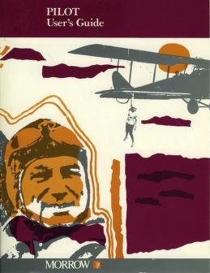

# CSPILOT



## CSPILOT

CSPILOT is a simple interpreter for the PILOT language ( https://en.wikipedia.org/wiki/PILOT )

The implementation is based on the 1984 book "PILOT Users Guide" by Morrow Inc ( You can find a pdf copy in the doc folder )

## NOTES

Notes on the current implementation :

- The current statements format is :

```
INSTRUCTION[CONDITION]:[PARAMETERS]
```

- The optional heading label of instructions has been removed

- Instructions, Conditions, Labels and Variables must be UPPERCASE

- Floats are valid as value for Numeric Variables

- The CASE instruction have the following format :

```
CASE: #VARIABLE *LABEL1, *LABEL2, *LABEL3, etc...
```

- The COMPUTE instruction have mandatory __'#'__ prefix for every numeric variable involved

- The CUR function is available only on windows platform
The CUR function accept also numeric variables as input

- The ESC function can be used anywhere in the program

- The KEYBOARD function give the user an amount of time to press a key.
If a key is pressed by the end of time it is stored as a string, otherwise "TIMEOUT" will be stored.
The inpu of KEYBOARD function can be tested with the MATCH instruction.

- The INTERVAL function set the delay used by KEYBOARD and WAIT instructions in seconds (default delay 5 sec).

- The RESET function will reset only the numeric variables that have already been created

- CP/M instructions are not available

## PERSONAL NOTES

This is my first C# project, so code is not optimal.